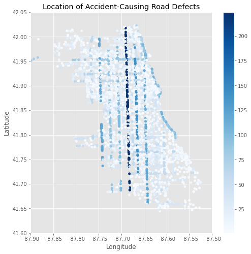
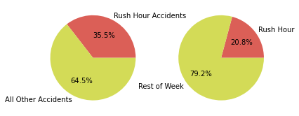
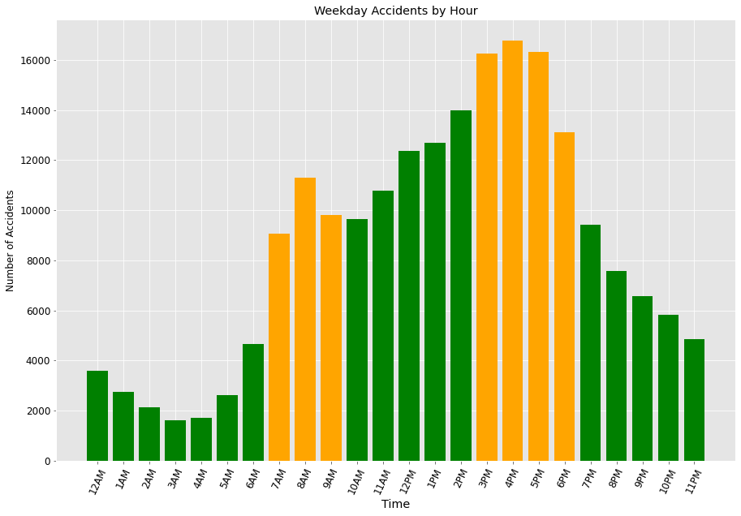
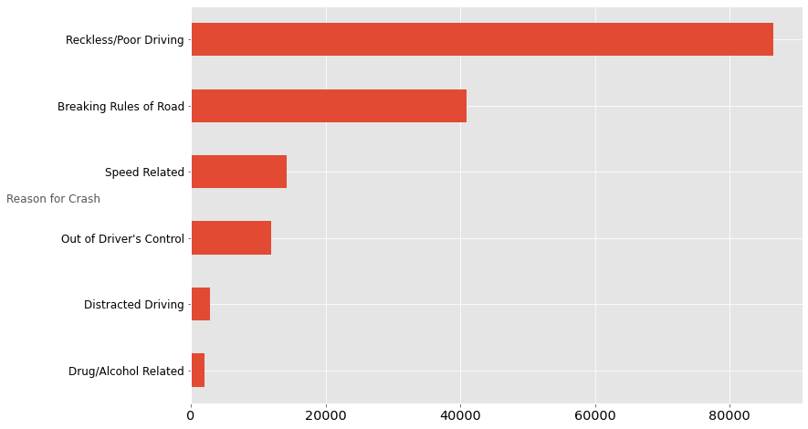
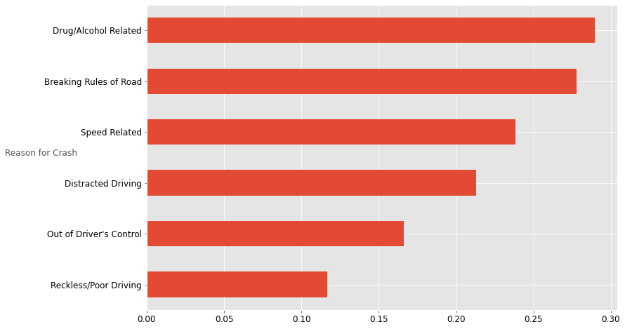
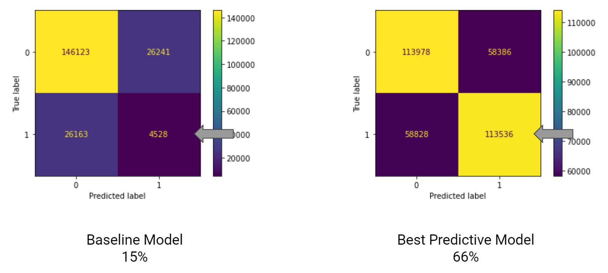

# Predicting and Preventing Car Accidents in Chicago

 
 Image courtesy of [iStock](https://www.istockphoto.com/search/2/image?phrase=chicago+skyline)
  
# Overview
We looked at data from the [Chicago Data Portal](https://data.cityofchicago.org/), specifically on [reported car accidents](https://data.cityofchicago.org/Transportation/Traffic-Crashes-Crashes/85ca-t3if) within the city. We stratified the data to begin from Jan 1, 2019 through Sep 12, 2021 (the most recent update from when we pulled the data). 
  
Our final data frame contained about 270,000 records to analyze.
  
# Business Problem
### The Chicago City Council wants to reduce the number of serious accidents in their city. 
  Can we build a model predicting the worst accidents there? 
  
# Select the target and features 
  * We used injuries_total as a categorical (1 indicating an injury in the accident, 0 indicating none) column as our target. 
  * We selected features through trial and error and basic correlation. 
### Features Used: 
  * Road defect
  * Rush hour or not
  * Crash type
  * Weather Condition
  * Simple reason for crash 

# Initial findings
  * About 36% of all accidents occur during reekday rush hour.
  * Certain roads have defects that lead to more accidents, with the main offender being Western Ave (see below).
  * Disobeying the rules of the road, along with drug/alcohol abuse, lead to most accidents that result in injury. 
  
 
  
The above image highlights accidents caused by defects in the road. The main offenders are: 
  * Western Ave
  * Ashland Ave
  * Halsted St
  * Cicero Ave
  * Lake Shore Dr NB 

 
The pie chart on the left shows the amount of accidents that occur during weekday rush hour. The one on the right shows how many hours of rush hour take up each week. 
  
 
About 45% of weekday accidents occur during rush hour.
  
 
The largest cause of accidents in general is reckless/poor driving and decision making (poor lane changes, etc.) 

 
However, most injuries in accidents were drug/alcohol related and due to breaking the rules of the road (running a stop sign, etc.) 
  
 
We created a baseline model on the left which did a poor job predicting injury results (1 = injury, 0 = no injury). 
Our second model, on the right, did a much better job using Recall as the underlying metric. 
  
Our recommendations include: 
  * More visible/obvious traffic signs
  * Increase the delay between the red and green light
  * More resources towards drunk driving prevention and education
  * Quicker maintenance on most frequently used roads
  * Create safer and more reliable rush hour commuting environments and transportation options
  * Increase number of first aid responders on-duty during these times

